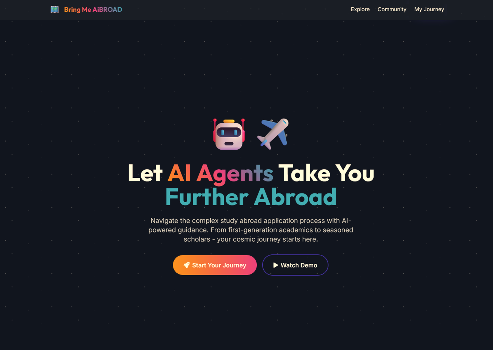
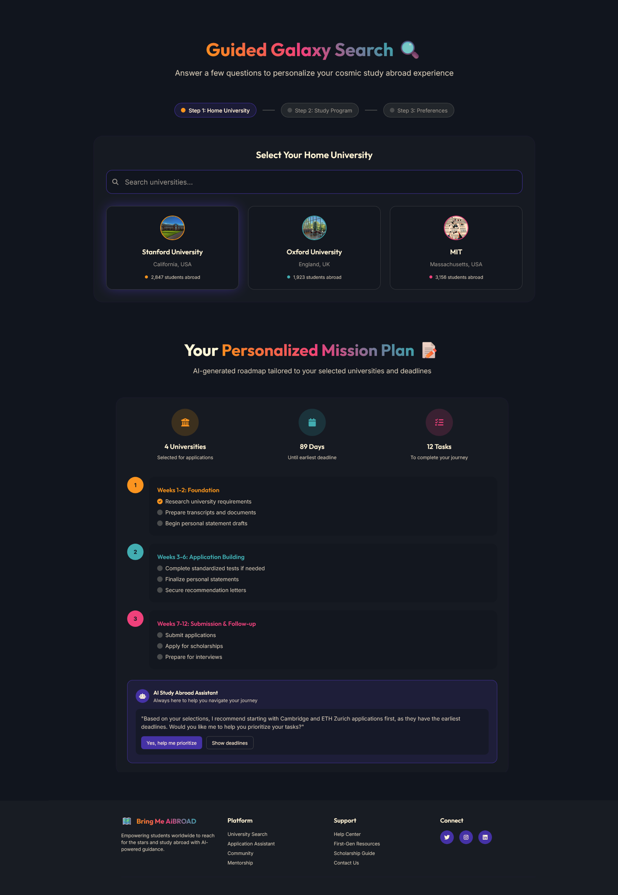

# Bring Me *Ai*BROAD 🗺️🎓
## Let 🤖 AI Agents Take You Further Abroad ✈️

<table style="width:100%;">
  <tr>
    <td style="width:50%; vertical-align:top;">
      
    </td>
    <td style="width:50%; vertical-align:top;">
      
    </td>
  </tr>
</table>

### Problem Statement & Solution❗
Studying abroad can be transformative, but the complex, time‑consuming application process—especially for first‑generation students without support—often feels overwhelming. Without clear guidance, many spend hours searching scattered university information instead of confidently finding and applying to suitable programs. This platform addresses these challenges by streamlining the search and application process, ensuring that every student has the opportunity to broaden their horizons. Our platform is designed to:

#### 🤝👩‍🎓 **Support First-Generation Academics**
By providing a user-friendly interface, we help students who lack traditional support networks to explore international study opportunities.
#### ⏳ **Save Time**
Our platform aggregates relevant information, allowing users to quickly find suitable programs and deadlines.

## Features ✨
 

1. **Guided Search** 🔍:
Users answer a few required questions about their home university and study program to personalize the search results.
2. **Optional Filters** ⚙️:
Users can optionally provide their GPA and budget to further tailor the recommendations.
3. **Relevant University Matches** 🏛️🎯:
The platform displays a list of universities that fit the user's criteria. Users can select universities of interest and view detailed information, including authentic student experiences.
4. **Personalized Application Plan** 📝:
The application plan is generated and shown directly in the user interface to help users organize their next steps.
5. **Application Deadlines** 📅:
Users are shown the application deadlines for their selected universities to ensure they never miss an important date.

## 💻🛠️ Technology Stack
### Backend (Multi-Agent System)
- Python
- Microsoft Azure (LLM: Azure OpenAI)
- LangChain & LangGraph (AI Frameworks for Agent Orchestration)
- FastAPI (Web Framework for API)
- HTTP requests (Client-Server Communication)
### Frontend (Web App)
- JavaScript (JS) & CSS
- ReactJS (UI Library) & React Markdown (Markdown Rendering)
- Vite (Build Tool)

## ⚡️ Usage (Setup)   
1. **Secrets Keys** (*AzureOpenAI* credentials) 🔑

   Create an environment file (.env) and place it in backend root folder. Fill in "..." with your API key and Endpoint url:
   ```
   AZURE_OPENAI_API_KEY = "..."
   AZURE_OPENAI_ENDPOINT = "..."
   ```
2. **Docker** 🐳

   Execute command
   ```
   docker compose up -d
   ```

## Credits / Acknowledgements
This team project was initially developed during the 24-hour Q-Hackathon 2025 @ Q-Summit (April 23rd - 24th) in 🇩🇪

© 2025
